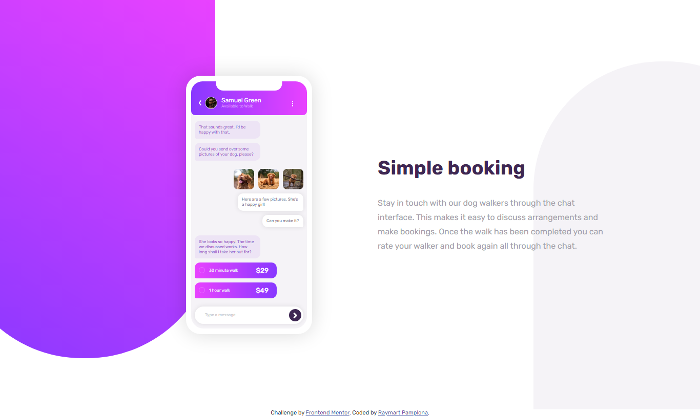
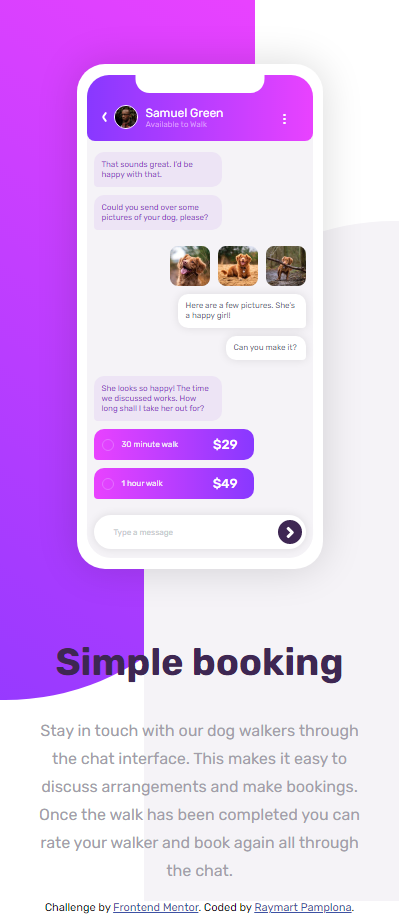

# Frontend Mentor - Chat app CSS illustration solution

This is a solution to the [Chat app CSS illustration challenge on Frontend Mentor](https://www.frontendmentor.io/challenges/chat-app-css-illustration-O5auMkFqY). Frontend Mentor challenges help you improve your coding skills by building realistic projects. 

## Table of contents

- [Overview](#overview)
  - [The challenge](#the-challenge)
  - [Screenshot](#screenshot)
  - [Links](#links)
- [My process](#my-process)
  - [Built with](#built-with)
  - [What I learned](#what-i-learned)
  - [Continued development](#continued-development)
  - [Useful resources](#useful-resources)
- [Author](#author)
- [Acknowledgments](#acknowledgments)

### The challenge

Users should be able to:

- View the optimal layout for the site depending on their device's screen size
- See hover states for all interactive elements on the page

### Screenshot

### Links

Live Site URL: [Live site of the challenge hosted here](https://pikapikamart.github.io/frontendmentor-chat-app/)

## My process

Hello, this is my seventh challenge here in frontend mentor. This custom chat app was pretty fun to create since you make it from scratch. I dint't use any external source just pure css and js^

### Built with

- Semantic HTML5 markup
- CSS custom properties
- Javscript
- FlexBox
- Sass preprocessor

I said that I won't use any frameworks and build it from scratch to be more exciting and challenging

### What I learned

This challenge made me more proud of what I can create using just css to style without having to use any other components^

### Continued development

I want to focus more on creating more complex designs and also designing things on my own time

## Author

- Website - Well I haven't made my profile portfolio, gonna make it sooon when I know a lot of stuffs
- Frontend Mentor - [@pikamart](https://www.frontendmentor.io/profile/pikamart)
- Twitter - [@RaymartPamplona](https://twitter.com/RaymartPamplona)
